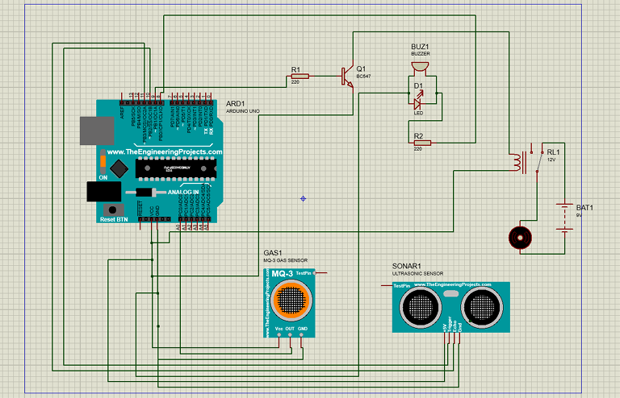
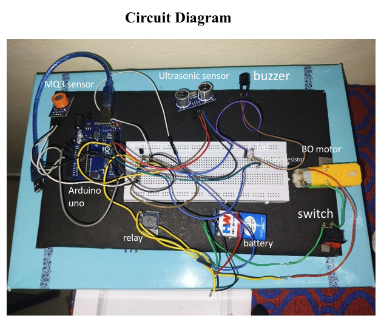

# Alcohol Detection, Engine Blocking, and Automatic Braking System

[-00979D.svg)](https://www.arduino.cc/)

## 📌 Overview
This project is a smart vehicle safety system that combines **alcohol detection**, **engine blocking**, and **automatic braking**. It uses an **MQ-3 alcohol sensor** to detect intoxication and an **ultrasonic sensor** to sense vehicles or obstacles ahead. Based on the inputs, the system either blocks engine ignition or stops the vehicle using a braking mechanism.

Built using **Arduino**, relay modules, motor simulation, and buzzers, the prototype demonstrates an effective prevention method against drunk driving and collisions.

## 📂 Repository Structure

| File | Description |
| :--- | :--- |
| `vehicle_safety_system.ino` | **Main Code:** The Arduino sketch governing sensor logic and actuator control. |
| `Vehicle_Safety.png` | **System Flow:** High-level overview of the integrated safety mechanisms. |
| `Vehicle_Safety1.png` | **Circuit Diagram:** Detailed wiring of sensors, relays, and the Arduino board. |

---

## 🧩 Components Used
* **MQ-3 Alcohol Sensor**
* **Ultrasonic Sensor (HC-SR04)**
* **Arduino Uno**
* **Relay Module**
* **BO Motor / Engine Simulation**
* **Buzzer**
* **LED (optional indicator)**
* **Breadboard**
* **9V Battery / Power Supply**
* **Switch**
* **NPN Transistor** (if used)
* **220Ω Resistor** (for LED/buzzer)

## ⚙️ Working Principle

### ✅ 1. Alcohol Detection & Engine Blocking
The MQ-3 sensor detects alcohol in the driver's breath. If alcohol exceeds the threshold:
* Engine/motor is turned **OFF** via relay.
* Buzzer/LED alerts the condition.

### ✅ 2. Automatic Braking Using Ultrasonic Sensor
The HC-SR04 ultrasonic sensor continuously measures the distance ahead. If an obstacle/vehicle is detected within a preset range:
* The Arduino sends a signal to stop the motor (simulating braking).
* An alarm or indicator is triggered.

*Both systems work independently and together for overall vehicle safety.*

---

## ✅ Applications
* Drunk driving prevention
* Autonomous braking systems
* Smart vehicle prototypes
* Road safety projects

---
**Developed by [rohanasgowda](https://github.com/rohanasgowda)**
